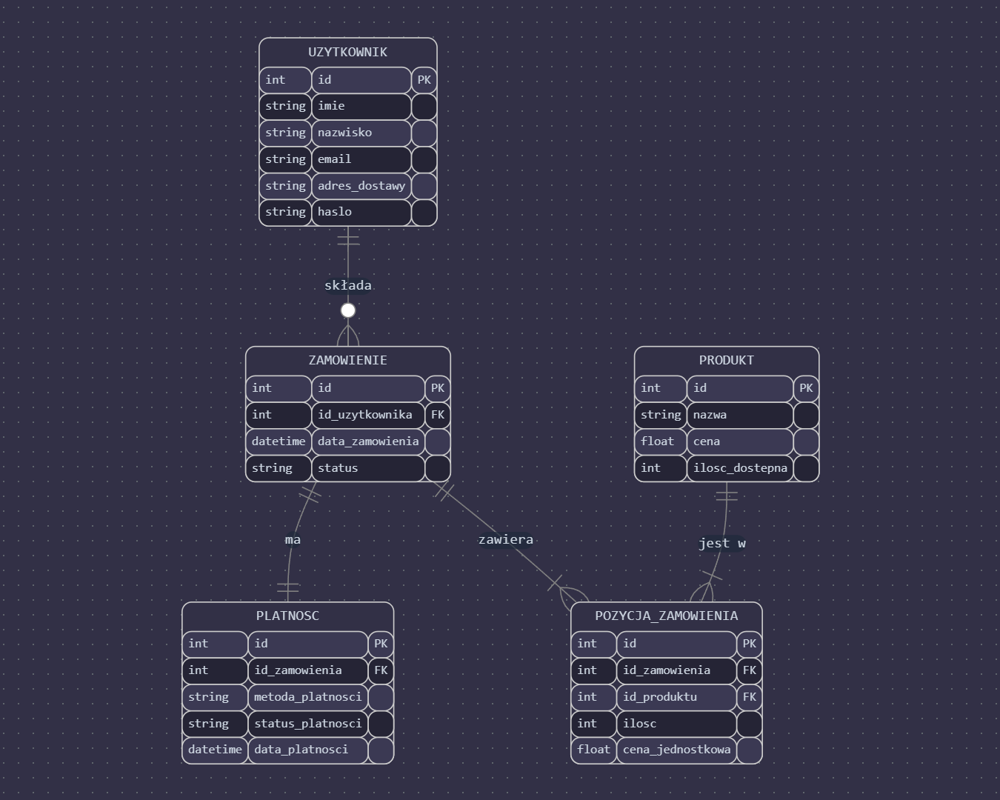
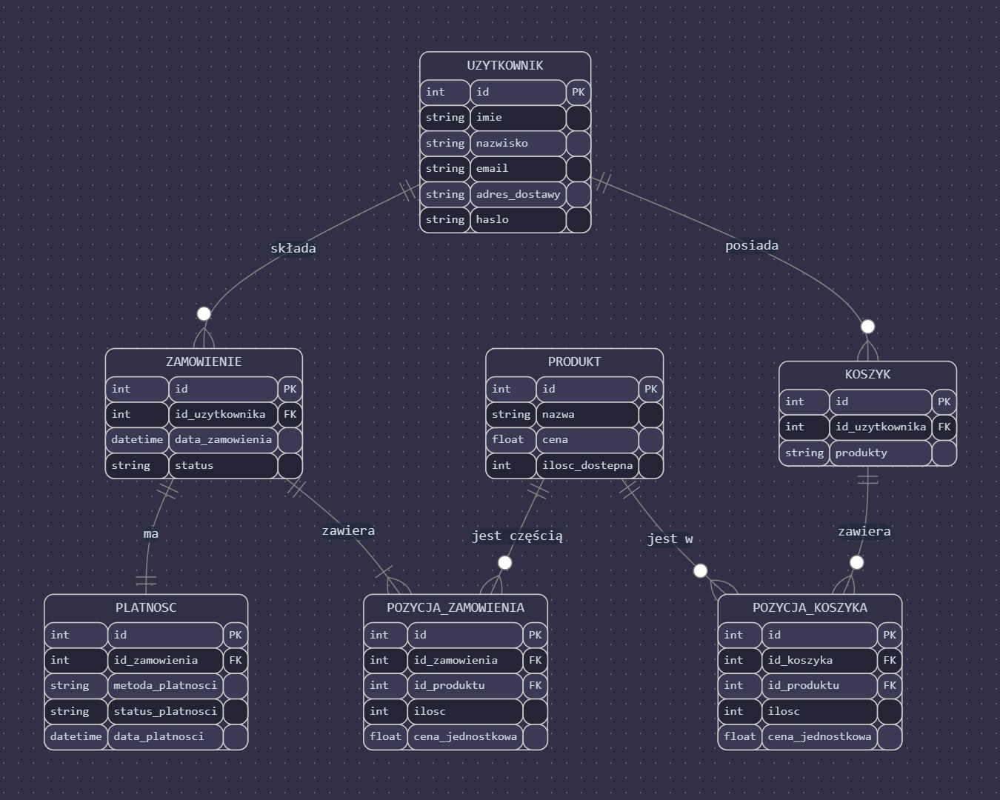

Projektowanie bazy danych 
==================================================

:Autor: Dominika Półchłopek

Wprowadzenie
------------
W ramach pracy zaprezentowano pełny cykl projektowania bazy, obejmujący model konceptualny, logiczny oraz fizyczny. Model konceptualny ilustruje główne encje systemu oraz relacje pomiędzy nimi, stanowiąc podstawę do dalszego uszczegółowienia struktury danych. Na tej podstawie opracowano model logiczny, który definiuje szczegółowe atrybuty oraz klucze główne i obce dla każdej z tabel. W końcowym etapie przygotowano model fizyczny, dostosowany do implementacji w dwóch środowiskach: PostgreSQL oraz SQLite.

Projektowana baza danych umożliwia zarządzanie informacjami o produktach, użytkownikach, zamówieniach, płatnościach oraz procesach zakupowych w sklepie internetowym. Dokumentacja zawiera również diagramy oraz opisy integralności danych.

Model Konceptualny
------------------

W diagramie użyto następującej notacji:
   * ||--o{ oznacza relację "jeden do wielu" (np. jeden użytkownik może mieć wiele zamówień)
   * ||--|| oznacza relację "jeden do jednego" (np. zamówienie ma dokładnie jedną płatność)
   * ||--|{ oznacza relację "jeden do wielu" z obowiązkowym wystąpieniem

Użytkownik (Klient)
#######
Definicja: Osoba korzystająca ze sklepu internetowego

Atrybuty:
   * id: unikalny identyfikator użytkownika (PK - Primary Key)
   * imie: imię użytkownika
   * nazwisko: nazwisko użytkownika
   * email: adres email użytkownika
   * adres_dostawy: adres dostawy zamówień
   * haslo: hasło dostępu

Produkt
#######
Definicja: Towar dostępny w sklepie

Atrybuty:
   * id: unikalny identyfikator produktu (PK)
   * nazwa: nazwa produktu
   * cena: cena jednostkowa produktu
   * ilosc_dostepna: aktualny stan magazynowy

Zamówienie
#######
Definicja: Zbiór produktów zamówionych przez użytkownika

Atrybuty:
   * id: unikalny identyfikator zamówienia (PK)
   * id_uzytkownika: identyfikator użytkownika (FK - Foreign Key)
   * data_zamowienia: data utworzenia zamówienia
   * status: stan realizacji zamówienia

Pozycja Zamówienia
#######
Definicja: Jednostkowy produkt w ramach zamówienia

Atrybuty:
   * id: unikalny identyfikator pozycji (PK)
   * id_zamowienia: identyfikator zamówienia (FK)
   * id_produktu: identyfikator produktu (FK)
   * ilosc: liczba sztuk produktu
   * cena_jednostkowa: cena produktu w momencie zamówienia

Płatność
#######
Definicja: Transakcja finansowa związana z zamówieniem

Atrybuty:
   * id: unikalny identyfikator płatności (PK)
   * id_zamowienia: identyfikator zamówienia (FK)
   * metoda_platnosci: sposób zapłaty
   * status_platnosci: stan płatności
   * data_platnosci: data wykonania płatności

Szczegółowa Analiza Encji i Relacji
##########

Encje Podstawowe:
   * Użytkownik (Klient): reprezentuje klientów sklepu
   * Produkt: przechowuje informacje o dostępnych produktach
   * Zamówienie: główna encja łącząca użytkownika z produktami

Encje Słabe:
   * Pozycja Zamówienia: zależy od zamówienia i produktu
   * Płatność: bezpośrednio powiązana z konkretnym zamówieniem

Relacje:
   * Jeden użytkownik może mieć wiele zamówień (||--o{)
   * Każdy produkt może pojawić się w wielu pozycjach zamówienia (||--|{)
   * Zamówienie ma dokładnie jedną płatność (||--||)

Normalizacja
#######

Model jest znormalizowany do 3NF, co zapewnia:
 * Integralność danych
 * Unikanie anomalii przy aktualizacji
 * Efektywne zapytania
 * Łatwą rozszerzalność systemu

Model logiczny
---------

Struktura Encji
##########

Użytkownik (Klient)
##########

Definicja: Osoba korzystająca ze sklepu internetowego

Atrybuty:
   * id (PK) - unikalny identyfikator użytkownika
   * imie - imię użytkownika
   * nazwisko - nazwisko użytkownika
   * email - adres email użytkownika
   * adres_dostawy - adres dostawy zamówień
   * haslo - hasło dostępu

Produkt
##########

Definicja: Towar dostępny w sklepie

Atrybuty:
   * id (PK) - unikalny identyfikator produktu
   * nazwa - nazwa produktu
   * cena - cena jednostkowa produktu
   * ilosc_dostepna - aktualny stan magazynowy

Zamówienie
##########

Definicja: Zbiór produktów zamówionych przez użytkownika

Atrybuty:
   * id (PK) - unikalny identyfikator zamówienia
   * id_uzytkownika (FK) - identyfikator użytkownika
   * data_zamowienia - data utworzenia zamówienia
   * status - stan realizacji zamówienia

Pozycja Zamówienia
##########

Definicja: Jednostkowy produkt w ramach zamówienia

Atrybuty:
   * id (PK) - unikalny identyfikator pozycji
   * id_zamowienia (FK) - identyfikator zamówienia
   * id_produktu (FK) - identyfikator produktu
   * ilosc - liczba sztuk produktu
   * cena_jednostkowa - cena produktu w momencie zamówienia

Płatność
##########

Definicja: Transakcja finansowa związana z zamówieniem

Atrybuty:
   * id (PK) - unikalny identyfikator płatności
   * id_zamowienia (FK) - identyfikator zamówienia
   * metoda_platnosci - sposób zapłaty
   * status_platnosci - stan płatności
   * data_platnosci - data wykonania płatności

Koszyk
##########

Definicja: Tymczasowe przechowywanie wybranych produktów

Atrybuty:
   * id (PK) - unikalny identyfikator koszyka
   * id_uzytkownika (FK) - identyfikator użytkownika
   * produkty - lista produktów

Pozycja Koszyka
##########

Definicja: Produkt tymczasowo wybrany do zakupu

Atrybuty:
   * id (PK) - unikalny identyfikator pozycji
   * id_koszyka (FK) - identyfikator koszyka
   * id_produktu (FK) - identyfikator produktu
   * ilosc - liczba sztuk produktu
   * cena_jednostkowa - cena produktu

Relacje Między Encjami
##########

Użytkownik - Zamówienie
##########

* Relacja: jeden do wielu (||--o{)
* Jeden użytkownik może mieć wiele zamówień
* Każde zamówienie należy do jednego użytkownika

Produkt - Pozycja Zamówienia
##########

* Relacja: jeden do wielu z obowiązkowym wystąpieniem (||--|{)
* Produkt może pojawić się w wielu pozycjach zamówień
* Pozycja zamówienia musi odnosić się do istniejącego produktu

Zamówienie - Płatność
##########

* Relacja: jeden do jednego (||--||)
* Każde zamówienie ma dokładnie jedną płatność
* Płatność jest przypisana do jednego zamówienia

Koszyk - Pozycja Koszyka
##########

* Relacja: jeden do wielu (||--o{)
* Koszyk może zawierać wiele pozycji
* Pozycja koszyka musi należeć do koszyka

Normalizacja
##########

Model jest znormalizowany do 3NF (Trzeciej Formy Normalnej):

Pierwsza Forma Normalna (1NF)
##########
* Brak powtarzających się grup atrybutów
* Każdy atrybut jest atomowy

Druga Forma Normalna (2NF)
##########
* Wszystkie atrybuty zależą pełnie od klucza głównego
* Usunięto częściową zależność atrybutów

Trzecia Forma Normalna (3NF)
##########
* Usunięto transatywne zależności
* Każdy atrybut zależy tylko od klucza głównego

Zalety Modelu
##########

Integralność Danych
##########

* Klucze obce zapewniają spójność danych
* Unikalne identyfikatory uniemożliwiają duplikaty
* Kontrola typów danych zapobiega nieprawidłowym wartościom

Efektywność
##########
* Optymalna struktura dla częstych operacji
* Możliwość efektywnego indeksowania
* Łatwa rozszerzalność systemu

Bezpieczeństwo
##########

* Hasła są przechowywane w sposób bezpieczny
* Kontrola dostępu przez relacje
* Możliwość dodania dodatkowych ograniczeń

Rozszerzalność
##########

* Łatwe dodawanie nowych encji
* Możliwość rozszerzenia istniejących relacji
* Elastyczność w przypadku zmian wymagań

Model fizyczny
------------

PostgreSQL
#########

.. code-block:: sql

      CREATE TABLE Uzytkownicy (
       id_uzytkownika SERIAL PRIMARY KEY,
       imie VARCHAR(255) NOT NULL,
       nazwisko VARCHAR(255) NOT NULL,
       email VARCHAR(255) UNIQUE NOT NULL,
       adres_dostawy TEXT,
       haslo_hash VARCHAR(255) NOT NULL
   );

   CREATE TABLE Produkty (
       id_produktu SERIAL PRIMARY KEY,
       nazwa VARCHAR(255) NOT NULL,
       cena DECIMAL(10, 2) NOT NULL,
       ilosc_dostepna INTEGER NOT NULL DEFAULT 0
   );

   CREATE TABLE Zamowienia (
       id_zamowienia SERIAL PRIMARY KEY,
       id_uzytkownika INTEGER NOT NULL,
       data_zamowienia TIMESTAMP NOT NULL DEFAULT CURRENT_TIMESTAMP,
       status VARCHAR(50) NOT NULL CHECK(status IN ('w_trakcie', 'zrealizowane', 'anulowane')),
       FOREIGN KEY (id_uzytkownika) REFERENCES Uzytkownicy(id_uzytkownika)
   );

   CREATE TABLE PozycjeZamowienia (
       id_pozycji SERIAL PRIMARY KEY,
       id_zamowienia INTEGER NOT NULL,
       id_produktu INTEGER NOT NULL,
       ilosc INTEGER NOT NULL,
       cena_jednostkowa DECIMAL(10, 2) NOT NULL,
       FOREIGN KEY (id_zamowienia) REFERENCES Zamowienia(id_zamowienia),
       FOREIGN KEY (id_produktu) REFERENCES Produkty(id_produktu)
   );

   CREATE TABLE Platnosci (
       id_platnosci SERIAL PRIMARY KEY,
       id_zamowienia INTEGER UNIQUE NOT NULL,
       metoda_platnosci VARCHAR(100) NOT NULL,
       status_platnosci VARCHAR(50) NOT NULL CHECK(status_platnosci IN ('oplacone', 'oczekujace')),
       data_platnosci TIMESTAMP NOT NULL DEFAULT CURRENT_TIMESTAMP,
       FOREIGN KEY (id_zamowienia) REFERENCES Zamowienia(id_zamowienia)
   );

   CREATE TABLE Koszyki (
       id_koszyka SERIAL PRIMARY KEY,
       id_uzytkownika INTEGER NOT NULL,
       produkty JSONB NOT NULL,
       FOREIGN KEY (id_uzytkownika) REFERENCES Uzytkownicy(id_uzytkownika)
   );

SQLite
#########

.. code-block:: sql

   CREATE TABLE Uzytkownicy (
    id_uzytkownika INTEGER PRIMARY KEY AUTOINCREMENT,
    imie TEXT NOT NULL,
    nazwisko TEXT NOT NULL,
    email TEXT UNIQUE NOT NULL,
    adres_dostawy TEXT,
    haslo_hash TEXT NOT NULL
   );

   CREATE TABLE Produkty (
      id_produktu INTEGER PRIMARY KEY AUTOINCREMENT,
      nazwa TEXT NOT NULL,
       cena REAL NOT NULL,
       ilosc_dostepna INTEGER NOT NULL DEFAULT 0
   );

   CREATE TABLE Zamowienia (
       id_zamowienia INTEGER PRIMARY KEY AUTOINCREMENT,
       id_uzytkownika INTEGER NOT NULL,
       data_zamowienia DATETIME NOT NULL DEFAULT CURRENT_TIMESTAMP,
       status TEXT NOT NULL CHECK(status IN ('w_trakcie', 'zrealizowane', 'anulowane')),
       FOREIGN KEY (id_uzytkownika) REFERENCES Uzytkownicy(id_uzytkownika)
   );

   CREATE TABLE PozycjeZamowienia (
       id_pozycji INTEGER PRIMARY KEY AUTOINCREMENT,
       id_zamowienia INTEGER NOT NULL,
       id_produktu INTEGER NOT NULL,
       ilosc INTEGER NOT NULL,
       cena_jednostkowa REAL NOT NULL,
       FOREIGN KEY (id_zamowienia) REFERENCES Zamowienia(id_zamowienia),
       FOREIGN KEY (id_produktu) REFERENCES Produkty(id_produktu)
   );

   CREATE TABLE Platnosci (
       id_platnosci INTEGER PRIMARY KEY AUTOINCREMENT,
       id_zamowienia INTEGER UNIQUE NOT NULL,
       metoda_platnosci TEXT NOT NULL,
       status_platnosci TEXT NOT NULL CHECK(status_platnosci IN ('oplacone', 'oczekujace')),
       data_platnosci DATETIME NOT NULL DEFAULT CURRENT_TIMESTAMP,
       FOREIGN KEY (id_zamowienia) REFERENCES Zamowienia(id_zamowienia)
   );

   CREATE TABLE Koszyki (
       id_koszyka INTEGER PRIMARY KEY AUTOINCREMENT,
       id_uzytkownika INTEGER NOT NULL,
       produkty TEXT NOT NULL,
       FOREIGN KEY (id_uzytkownika) REFERENCES Uzytkownicy(id_uzytkownika)
   );

.. list-table::
   :widths: 25 25 50
   :header-rows: 1

   * - Aspekt
     - PostgreSQL
     - SQLite
   * - Typ dla auto-incrementujących się kluczy
     - SERIAL
     - INTEGER PRIMARY KEY AUTOINCREMENT
   * - Typ dla tekstu
     - VARCHAR(255)
     - TEXT
   * - Typ dla liczb dziesiętnych
     - DECIMAL(10, 2)
     - REAL
   * - Typ dla dat i czasu
     - TIMESTAMP
     - DATETIME
   * - Typ dla danych JSON
     - JSONB
     - TEXT

Skrypty i zapytania
-------
PostgreSQL
########

.. code-block:: sql
   
   import psycopg
   import csv
   import json
   from datetime import datetime
   from typing import Optional, List, Dict
   from pathlib import Path

   class SklepDB:
       def __init__(self, creds_path: str = "postgresql/database_creds.json"):
           self.creds_path = creds_path
        
       def _get_connection(self) -> psycopg.Connection:
           """Prywatna metoda do pobierania połączenia z bazą"""
           try:
               with open(self.creds_path) as db_con_file:
                   creds = json.load(db_con_file)
                   return psycopg.connect(
                       host=creds['host_name'],
                       user=creds['user_name'],
                       dbname=creds['db_name'],
                       password=creds['password'],
                       port=creds['port_number']
                   )
           except Exception as e:
               print(f"Błąd podczas łączenia z bazą danych: {e}")
               raise
   
       def csvToPostgre(self, path: str, tabName: str, columns: List[str]) -> None:
           """
           Importuje dane z pliku CSV do wybranej tabeli w PostgreSQL
        
           Args:
               path: ścieżka do pliku CSV
               tabName: nazwa tabeli docelowej
               columns: lista kolumn do importu
           """
           try:
               conn = self._get_connection()
               c = conn.cursor()
               
               # Tworzenie tabeli z odpowiednimi typami danych
               column_defs = []
               for col in columns:
                   if col.endswith('_date'):
                       column_defs.append(f"{col} DATE")
                   elif col == 'status':
                       column_defs.append(f"{col} TEXT CHECK(status IN ('w_trakcie', 'zrealizowane', 'anulowane'))")
                   elif col == 'status_platnosci':
                       column_defs.append(f"{col} TEXT CHECK(status_platnosci IN ('oplacone', 'oczekujace'))")
                   elif col == 'produkty':
                       column_defs.append(f"{col} TEXT NOT NULL")
                   elif col == 'email':
                       column_defs.append(f"{col} TEXT UNIQUE NOT NULL")
                   elif col == 'haslo_hash':
                       column_defs.append(f"{col} TEXT NOT NULL")
                   elif col == 'ilosc_dostepna' or col == 'ilosc':
                       column_defs.append(f"{col} INTEGER NOT NULL DEFAULT 0")
                   elif col == 'cena' or col == 'cena_jednostkowa':
                       column_defs.append(f"{col} REAL NOT NULL")
                   else:
                       column_defs.append(f"{col} TEXT")
                    
               create_sql = f"""
                   CREATE TABLE IF NOT EXISTS {tabName} (
                       id SERIAL PRIMARY KEY,
                       {', '.join(column_defs)}
                   );
               """
            
               c.execute(create_sql)
               conn.commit()
               
               with open(path, newline='', encoding='utf-8') as csvfile:
                   reader = csv.DictReader(csvfile, delimiter=',')
                   insert_sql = f"""
                       INSERT INTO {tabName} ({', '.join(columns)})
                       VALUES ({', '.join(['%s' for _ in columns])})
                   """
                
                   for i, row in enumerate(reader, 1):
                       try:
                           values = [row[col] for col in columns]
                           c.execute(insert_sql, values)
                           if i % 1000 == 0:  # Commit co 1000 wierszy
                               conn.commit()
                               print(f"Przetworzono {i} wierszy...")
                       except Exception as e:
                           print(f"Błąd przy wierszu {i}: {e}")
                           conn.rollback()
                
                   conn.commit()
                   print(f"Import zakończony. Przetworzono {i} wierszy.")
                
           except Exception as e:
               print(f"Wystąpił błąd podczas importu: {e}")
           finally:
               if 'conn' in locals():
                   conn.close()

       def backup(self) -> None:
           """Tworzy kopię zapasową bazy danych"""
           try:
               conn = self._get_connection()
               with open("student23db_backup.sql", "w", encoding='utf-8') as f:
                   conn.backup(f)
               print("Kopia zapasowa została utworzona")
           except Exception as e:
               print(f"Błąd podczas tworzenia kopii zapasowej: {e}")
           finally:
               if 'conn' in locals():
                   conn.close()

       def restore(self) -> None:
           """Przywraca bazę danych z kopii zapasowej"""
           try:
               conn = self._get_connection()
               with open("student23db_backup.sql", "r", encoding='utf-8') as f:
                   conn.restore(f)
               print("Baza danych została przywrócona")
           except Exception as e:
               print(f"Błąd podczas przywracania bazy: {e}")
           finally:
               if 'conn' in locals():
                   conn.close()

       def dropTable(self, table: str) -> None:
           """Usuwa wybraną tabelę z bazy danych"""
           try:
               conn = self._get_connection()
               c = conn.cursor()
               c.execute(f'DROP TABLE IF EXISTS {table}')
               conn.commit()
               print(f"Tabela {table} została usunięta")
           except Exception as e:
               print(f"Błąd podczas usuwania tabeli: {e}")
           finally:
               if 'conn' in locals():
                   conn.close()

       def SQLuser_price(self) -> None:
           """Wyświetla użytkowników wraz z cenami ich zamówień"""
           try:
               conn = self._get_connection()
               c = conn.cursor()
            
               sql = """
                   SELECT 
                       u.imie || ' ' || u.nazwisko AS nazwa_uzytkownika,
                       SUM(p.cena * pz.ilosc) AS suma_zakupow
                   FROM Uzytkownicy u
                   JOIN Zamowienia z ON u.id_uzytkownika = z.id_uzytkownika
                   JOIN PozycjeZamowienia pz ON z.id_zamowienia = pz.id_zamowienia
                   JOIN Produkty p ON pz.id_produktu = p.id_produktu
                   GROUP BY u.id_uzytkownika
                   ORDER BY suma_zakupow DESC;
               """
            
               print("\nLista użytkowników wraz z sumą ich zakupów:")
               print("-" * 50)
               for row in c.execute(sql):
                   print(f"{row[0]}: {row[1]:.2f} zł")
                
           except Exception as e:
               print(f"Błąd podczas wykonywania zapytania: {e}")
           finally:
               if 'conn' in locals():
                   conn.close()

       def SQLdate_price(self) -> None:
           """Wyświetla ceny produktów według daty zamówienia"""
           try:
               conn = self._get_connection()
               c = conn.cursor()
            
               sql = """
                   SELECT 
                       strftime('%Y-%m', z.data_zamowienia) AS miesiac,
                       p.nazwa,
                       AVG(p.cena) AS srednia_cena
                   FROM Zamowienia z
                   JOIN PozycjeZamowienia pz ON z.id_zamowienia = pz.id_zamowienia
                   JOIN Produkty p ON pz.id_produktu = p.id_produktu
                   GROUP BY strftime('%Y-%m', z.data_zamowienia), p.id_produktu
                   ORDER BY miesiac, p.nazwa;
               """
            
            print("\nŚrednie ceny produktów według miesiąca:")
            print("-" * 50)
            current_month = None
            for row in c.execute(sql):
                if current_month != row[0]:
                    current_month = row[0]
                    print(f"\nMiesiąc: {current_month}")
                print(f"{row[1]}: {row[2]:.2f} zł")
                
        except Exception as e:
            print(f"Błąd podczas wykonywania zapytania: {e}")
        finally:
            if 'conn' in locals():
                conn.close()

SQLite
#########

.. code-block:: sql

   import sqlite3
   import json
   from datetime import datetime

   class SklepDB:
       def __init__(self, db_path='sqlite/litedata.db'):
           self.db_path = db_path
        
       def _get_connection(self):
           """Prywatna metoda do pobierania połączenia z bazą"""
           try:
               return sqlite3.connect(self.db_path)
           except sqlite3.Error as e:
               print(f"Błąd połączenia z bazą danych: {e}")
               raise
            
       def backup(self):
           """Tworzy kopię zapasową bazy danych"""
           try:
               conn1 = self._get_connection()
               backcon = sqlite3.connect('sqlite/backup_litedata.db')
               conn1.backup(backcon)
               print("Kopia zapasowa została utworzona")
           except Exception as e:
               print(f"Błąd podczas tworzenia kopii zapasowej: {e}")
           finally:
               conn1.close()
               backcon.close()

       def restore(self):
           """Przywraca bazę danych z kopii zapasowej"""
           try:
               conn1 = self._get_connection()
               backcon = sqlite3.connect('sqlite/backup_litedata.db')
               backcon.backup(conn1)
               print("Baza danych została przywrócona")
           except Exception as e:
               print(f"Błąd podczas przywracania bazy: {e}")
           finally:
               conn1.close()
               backcon.close()

       def dropTable(self, tabname):
           """Usuwa wybraną tabelę z bazy danych"""
           try:
               conn = self._get_connection()
               c = conn.cursor()
               c.execute(f"""DROP TABLE IF EXISTS {tabname};""")
               conn.commit()
               print(f"Tabela {tabname} została usunięta")
           except sqlite3.Error as e:
               print(f"Błąd podczas usuwania tabeli: {e}")
           finally:
               conn.close()

       def jsonToLite(self, dbPath, jsonPath, tabName, columns):
           """
           Importuje dane z JSON do wybranej tabeli w bazie SQLite
        
           Args:
               dbPath: ścieżka do bazy danych
               jsonPath: ścieżka do pliku JSON
               tabName: nazwa tabeli docelowej
               columns: lista kolumn do importu
           """
           try:
               conn = self._get_connection()
               c = conn.cursor()
            
               # Tworzenie tabeli z odpowiednimi typami danych
               column_defs = []
               for col in columns:
                   if col.endswith('_date'):
                       column_defs.append(f"{col} DATETIME")
                   elif col == 'status':
                       column_defs.append(f"{col} TEXT CHECK(status IN ('w_trakcie', 'zrealizowane', 'anulowane'))")
                   elif col == 'status_platnosci':
                       column_defs.append(f"{col} TEXT CHECK(status_platnosci IN ('oplacone', 'oczekujace'))")
                   elif col == 'produkty':
                       column_defs.append(f"{col} TEXT NOT NULL")
                   elif col == 'email':
                       column_defs.append(f"{col} TEXT UNIQUE NOT NULL")
                   elif col == 'haslo_hash':
                       column_defs.append(f"{col} TEXT NOT NULL")
                   elif col == 'ilosc_dostepna' or col == 'ilosc':
                       column_defs.append(f"{col} INTEGER NOT NULL DEFAULT 0")
                   elif col == 'cena' or col == 'cena_jednostkowa':
                       column_defs.append(f"{col} REAL NOT NULL")
                   else:
                       column_defs.append(f"{col} TEXT")
                       
               create_sql = f"""CREATE TABLE IF NOT EXISTS {tabName} (
                   id INTEGER PRIMARY KEY AUTOINCREMENT,
                   {', '.join(column_defs)}
               );"""
            
               c.execute(create_sql)
               conn.commit()
               
               with open(jsonPath) as f:
                   data = json.load(f)
                   
               insert_sql = f"""INSERT INTO {tabName} ({', '.join(columns)}) 
                              VALUES ({', '.join(['?' for _ in columns])})"""
            
               for item in data.get(tabName, []):
                   values = [item[col] for col in columns]
                   c.execute(insert_sql, values)
                
               conn.commit()
               print(f"Dane zostały zaimportowane do tabeli {tabName}")
            
           except sqlite3.Error as e:
               print(f"Błąd bazy danych: {e}")
           except FileNotFoundError:
               print(f"Plik JSON nie został znaleziony: {jsonPath}")
           except json.JSONDecodeError:
               print(f"Błąd parsowania pliku JSON: {jsonPath}")
           except Exception as e:
               print(f"Wystąpił nieoczekiwany błąd: {e}")
           finally:
               conn.close()

       def SQLuser_price(self):
           """Wyświetla użytkowników wraz z cenami ich zamówień"""
           try:
               conn = self._get_connection()
               c = conn.cursor()
            
               sql = """
                   SELECT 
                       u.imie || ' ' || u.nazwisko AS nazwa_uzytkownika,
                       SUM(p.cena * pz.ilosc) AS suma_zakupow
                   FROM Uzytkownicy u
                   JOIN Zamowienia z ON u.id_uzytkownika = z.id_uzytkownika
                   JOIN PozycjeZamowienia pz ON z.id_zamowienia = pz.id_zamowienia
                   JOIN Produkty p ON pz.id_produktu = p.id_produktu
                   GROUP BY u.id_uzytkownika
                   ORDER BY suma_zakupow DESC;
               """
            
               print("\nLista użytkowników wraz z sumą ich zakupów:")
               print("-" * 50)
               for row in c.execute(sql):
                print(f"{row[0]}: {row[1]:.2f} zł")
                
           except sqlite3.Error as e:
               print(f"Błąd podczas wykonywania zapytania: {e}")
           finally:
               conn.close()

       def SQLdate_price(self):
           """Wyświetla ceny produktów według daty zamówienia"""
           try:
               conn = self._get_connection()
               c = conn.cursor()
            
               sql = """
                   SELECT 
                       strftime('%Y-%m', z.data_zamowienia) AS miesiac,
                       p.nazwa,
                       AVG(p.cena) AS srednia_cena
                   FROM Zamowienia z
                   JOIN PozycjeZamowienia pz ON z.id_zamowienia = pz.id_zamowienia
                   JOIN Produkty p ON pz.id_produktu = p.id_produktu
                   GROUP BY strftime('%Y-%m', z.data_zamowienia), p.id_produktu
                   ORDER BY miesiac, p.nazwa;
               """
            
               print("\nŚrednie ceny produktów według miesiąca:")
               print("-" * 50)
               current_month = None
               for row in c.execute(sql):
                   if current_month != row[0]:
                       current_month = row[0]
                       print(f"\nMiesiąc: {current_month}")
                   print(f"{row[1]}: {row[2]:.2f} zł")
                   
           except sqlite3.Error as e:
               print(f"Błąd podczas wykonywania zapytania: {e}")
           finally:
               conn.close()
   
